# CRM

Customer Relationship Manager application during an intership at a tech company a web base app enables businesses to manage customer data, track sales and activities.

## Prerequisite

- Operating System - Window 10 or 11
- Angular version - v20.x.x
- NodeJS version -v22.x.x

## Installation

Describe step to install this project. Example

1. Clone the repository

```bash
git clone https://github.com/truongsondev/crm-project.git
```

2. Navigate to the project directory

```bash
cd crm-ui
```

3. Install dependencies:

```bash
npm install
```

## Usage

Run the application with the following command

```bash
npm start
```

## Application specifications

1. Authorization

There are 7 user roles in the system, include:

- **Administrator**: Has the highest level of access and privileges, can be CRUD action on User Managerment, Contacts, Sales Order Page and view Dashboard Page
- **Director**: Has broad access and control over the system, including the ability to manage sales, configure settings, and oversee all aspects of customer relationships.
- **Sales Manager**: Responsible for managing a team of sales representatives, tracking sales performance, creating and managing sales opportunities.
- **Sales Person**: Focuses on interacting with leads and opportunities, managing customer interactions, and working towards closing deals.
- **Contact manager**: Responsible for organizes, and manages contact information, and enhancing relationships with customers and other stakeholders.
- **Contact employee**: Is an employee who manages or interacts with customer contact information.
- **Guest user**: Who is limited to viewing data without the ability to modify it.

2. Authentication

First, the user must enter their username and password in the login form, as shown in the image below:

<p align="center">
   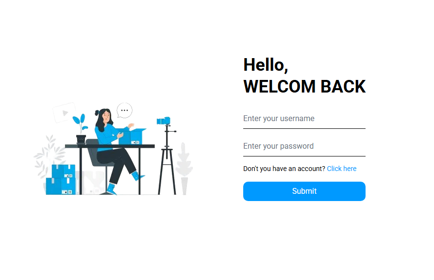
</p>

Next, when the user clicks the submit button, the client will send an HTTP request containing the **username** and **password** in the request body.

Upon receiving the request, the server extracts the username and password from `request.body`.

The server then looks up the username in the database. If the username exists, it compares the password sent by the user with the one stored in the database. If the passwords match, the server generates a private key and a public key, then uses the key pair to sign the access token and refresh token using the `RS256 algorithm.`

Finally, the server responds to the client with the user information and the token pair.

When the client receives the response from the server, it stores the user information in local storage and saves the token pair in cookies.  
The access token has an expiration time of **2 days**, while the refresh token expires in **7 days**.

- Workflow

<p align="center"> 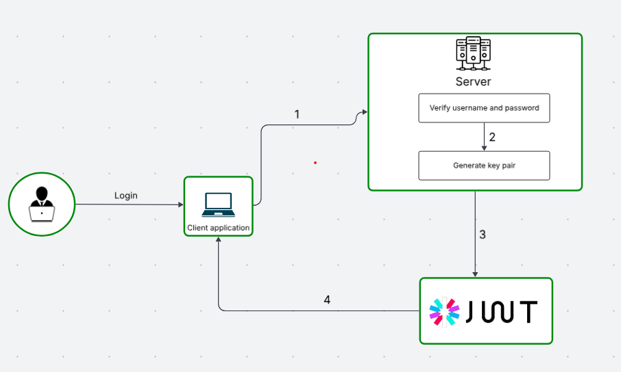 </p>

Note:

(1) Client send username and password, server receiving and verify them

(2) Server generate key pair

(3) Server generate token pair

(4) Server send information user and accesstoken, refreshtoken for client

## Features

1. User Manager

As an admin user, you can create, update, and manage all system users.

<p align="center"> 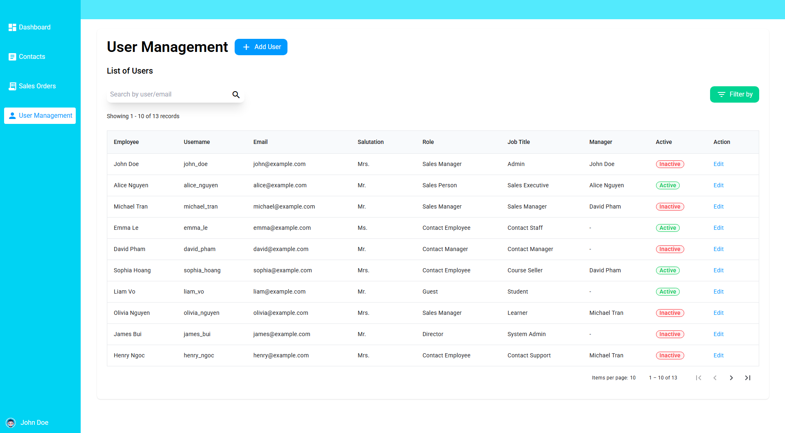 </p>

✅ Create User
The user with the ADMIN role clicks the Add User button.

The client displays a form with the necessary input fields.
The admin fills out the form and clicks the Submit button.

The client sends an HTTP POST request to the server with the form data in the request body.

The server receives the data from request.body, validates it, and stores the new user in the database.

If successful, the server responds with the newly created user data.

- Workflow

<p align="center"> 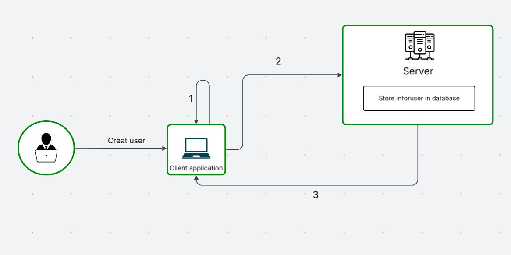 </p>
- Note

(1) The client verifies the information entered by the user.

(2) The client sends the information to the server, and the server stores it in the database.

(3) The server sends back the user information and a token (code) to the client.

✏️ Update User
The admin selects a user from the user list and clicks the Edit button.

A form pre-filled with the selected user's current data is displayed.

<p align="center"> 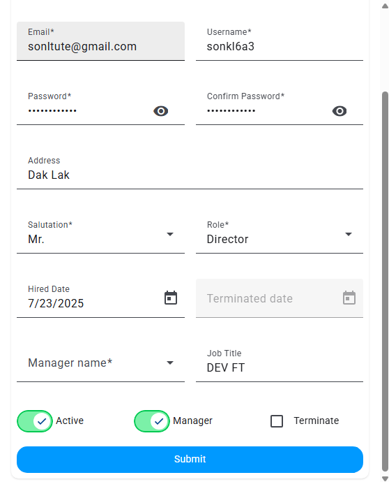 </p>

The admin modifies the desired fields and clicks Submit.

The client sends an HTTP PUT request with the updated data in the request body.

The server receives the data, updates the corresponding record in the database, and responds with the updated user data.

- Workflow

<p align="center"> 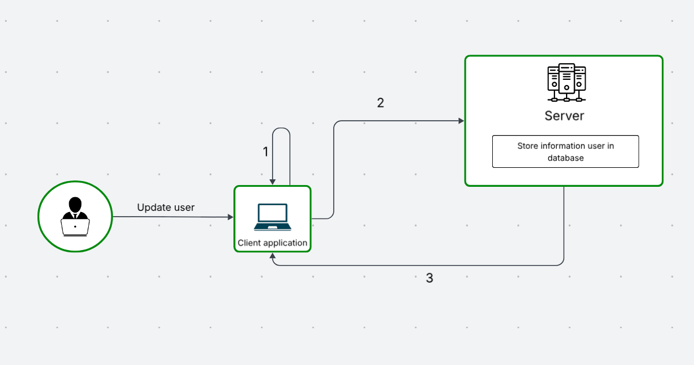 </p>
- Note

(1) The client verifies the information entered by the user.

(2) The client sends the information to the server, and the server stores it in the database.

(3) The server sends back the user information and a token (code) to the client.

2. Contact

As an admin user, Contact manager, Contact employee, you can create, update, delete and manage all contacts.

<p align="center"> 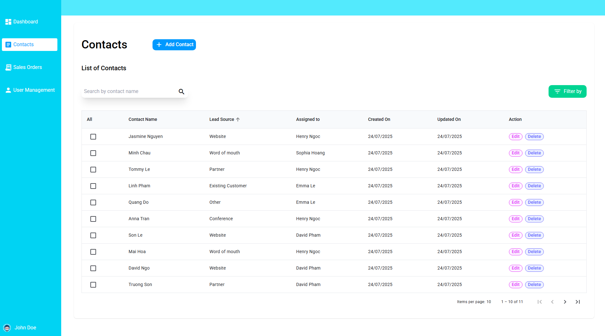 </p>

✅ 1. Create Contact
The user clicks the Add Contact button from the contact management page.

A form will be displayed allowing the user to enter contact details:

<p align="center"> 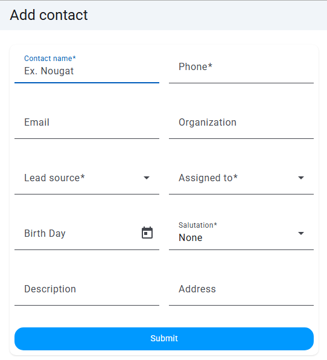 </p>

After filling in the form, the user clicks the Submit button.

The client sends an HTTP POST request containing the form data in the request body.

The server processes the request, validates the input, and stores the contact in the database.

If successful, the server returns the newly created contact information.

- Workflow

<p align="center"> 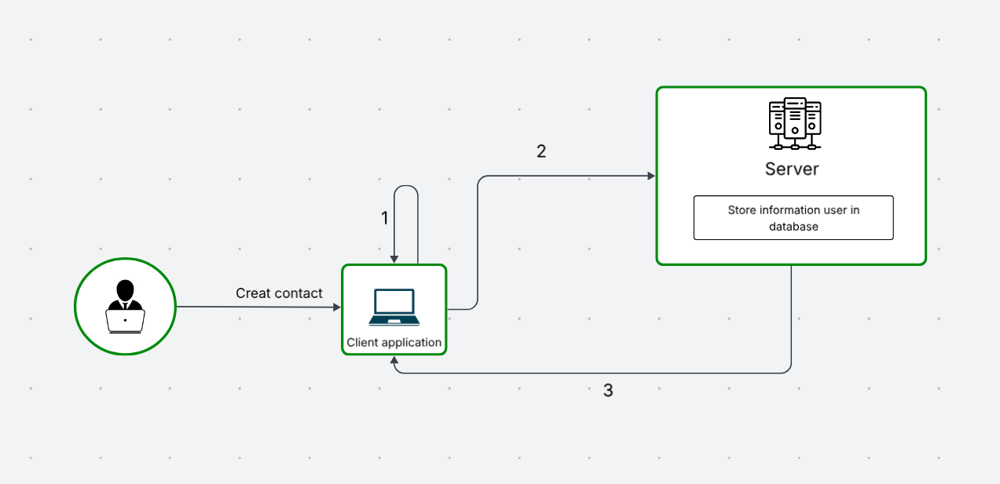 </p>
- Note

(1) The client verifies the information entered by the user.

(2) The client sends the information to the server, and the server stores it in the database.

(3) The server sends back the user information and a token (code) to the client.

✏️ 2. Update Contact
The user selects a contact from the list and clicks the Edit button.

A form with pre-filled data will be shown.

<p align="center"> 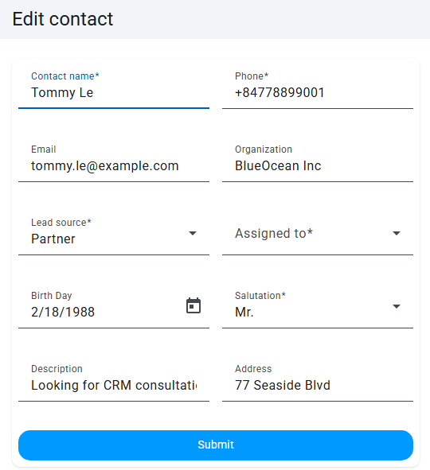 </p>

The user updates the necessary fields and clicks Submit.

The client sends an HTTP PUT request with the updated data and the contact ID.

The server validates the update and saves changes to the database.

A success response with updated contact data is returned.

- Wokflow

<p align="center"> 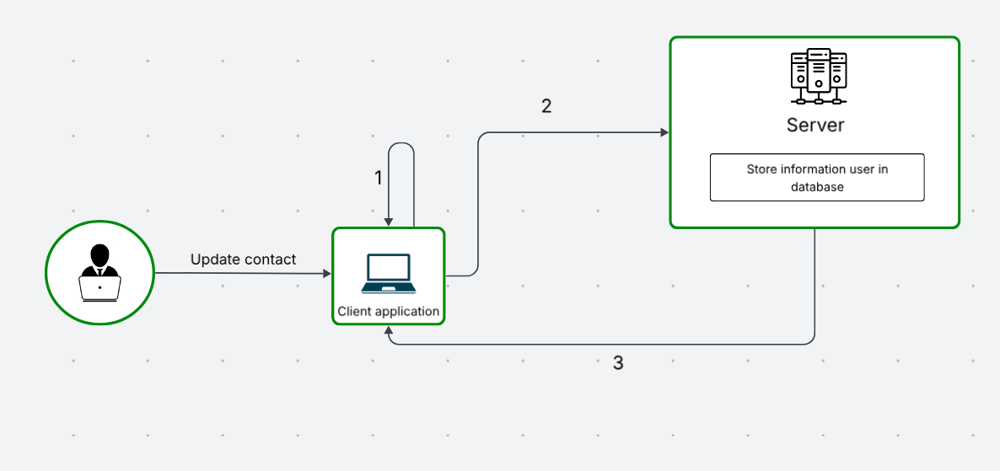 </p>
- Note

(1) The client verifies the information entered by the user.

(2) The client sends the information to the server, and the server stores it in the database.

(3) The server sends back the user information and a token (code) to the client.

🗑️ 3. Delete Contact
The user selects one or multiple contacts and clicks the Delete button.

A confirmation dialog appears.

<p align="center"> 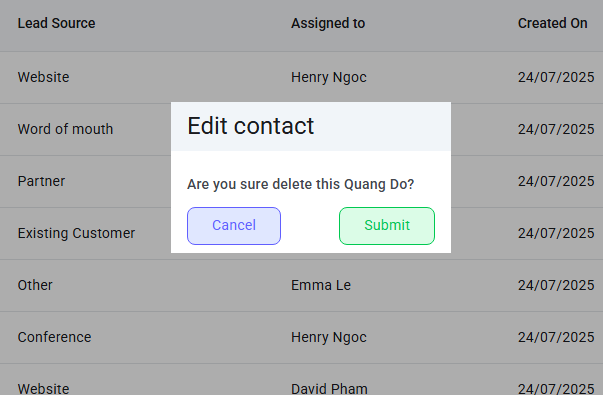 </p>

Upon confirmation, the client sends an HTTP DELETE request with the contact ID.

The server deletes the corresponding record and returns a success status or message

- Workflow

<p align="center"> 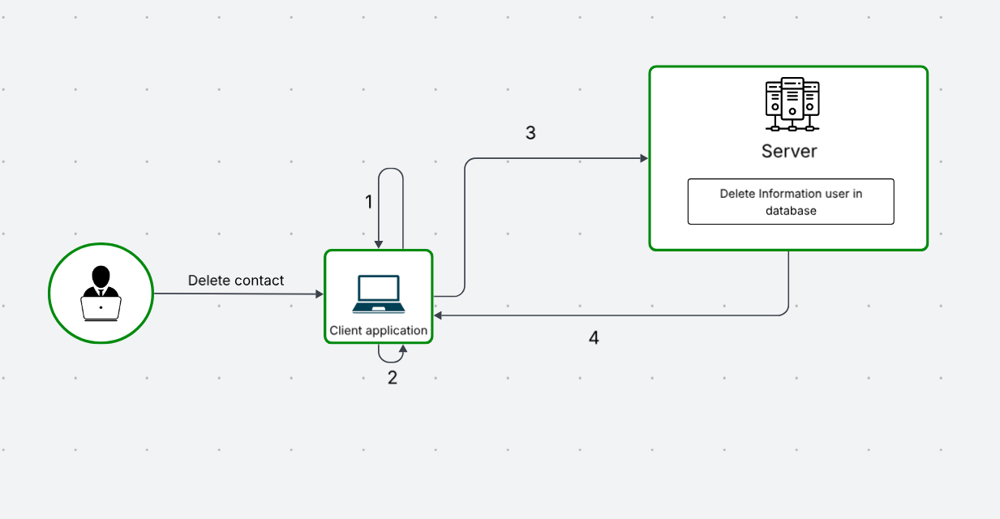 </p>
- Note

(1) The client verifies the information entered by the user.

(2) The client display a form verify action delete

(3) The client send id contact, server find contact by id and delete it

(4) The server sends back the user information and a token (code) to the client.
